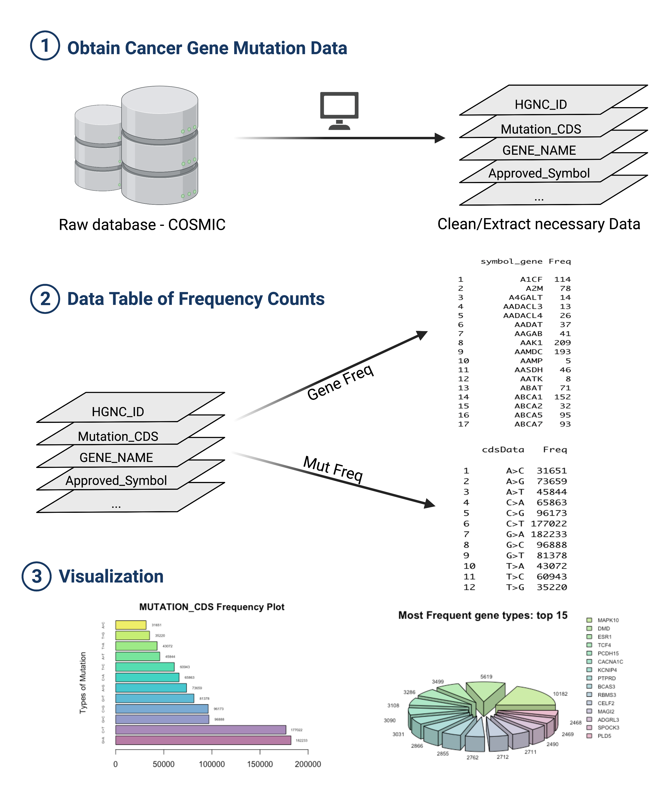

# CANMutVisual 

<!-- badges: start -->
<!-- badges: end -->

## Description

The goal of CANMutVisual is to allow simple visualization of large tsv cancer 
gene data file. With continuous addition of cancer gene data, it is difficult to 
communicate and transfer knowledge on cancer genome analysis. Therefore, CANMutVisual tool 
provide a path to expand on simplification of cancer genome research by visualizaing 
the data. The package take in data files and process it to simplify and extract 
necessary data to produce organized data frame. This package also provides functions to 
plot the extracted data to visualize the genomic mutational frequency in specific type 
of cancer. The package is intended for BCB410H bioinformatics R package development. 


## Installation

To install the latest version of CANMutVisual pacakge:

``` r
require("devtools")
devtools::install_github("Jiyun1201/CANMutVisual", build_vignettes = TRUE)
library("CANMutVisual")
```

To run the shinyApp:
``` r
CANMutVisual::runCANMutVisual()
```

## Overview

``` r
ls("package:CANMutVisual")
data(package = "CANMutVisual") # optional
```

**CANMutVisual** contains 5 functions for users:

**1. cosImport** function reads .tsv file that contain specific cancer types' 
gene data (which will be inputed from users) and common approved HGNC id file (which 
is already provided in the Data folder). Then, the function extracts only the necessary 
columns of data and return the resulting data frame. 

**2. countMut** function uses cosImport function in cosImport.R file to read from
cosmic file and uses that dataframe to extract IDsymbol column and return the
occurrence frequency of each gene types.

**3. mut_cds** function uses cosImport function in cosImport.R file to read from
cosmic file and uses that dataframe to obtain MUTATION_CDS column
The last three letters are extracted and compared with mutValue list and unmatched 
elements are deleted. Then, dataframe with two columns returned.

**4. plot_top_15** function uses countMut function in countMut.R file 
to get frequency data of each gene and return piechart using the data extracted.

**5. plot_cds** function uses mut_cds function in mut_cds.R file to get 
frequency data of each mutation and return barplot using the data extracted

Refer to vignette for more details:

``` r
browseVignettes(package = "CANMutVisual")
```

An overview of the package is illustrated below:

```
.
├── CANMutVisual.Rproj
├── DESCRIPTION
├── LICENSE
├── NAMESPACE
├── README.md
├── Data
│   ├── HGNC.tsv
│   └── MutantData.tsv
├── R
│   ├── cosImport.R
│   ├── gcountMut.R
│   ├── gene_mut_plot.R
│   ├── mut_cds.R
│   └── plot_cds.R
├── man
│   │
│   └── hello.Rd
├── inst
│   └── extdata
│       └── CANMutVisual.png
├── tests
│   ├── testthat
│   │   ├── test_cosImport.R
│   │   ├── test_countMut.R
│   │   ├── test_gene_mut_plot.R
│   │   ├── test_mut_cds.R
│   │   └── test_plot_cds.R
│   └── testthat.R
└── vignettes
    ├── plot_top_15_result.png
    ├── cosImport_result.png
    ├── countMut_result.png
    ├── mut_cds_result.png
    ├── cosImport_result.png
    └── plot_cds_result.png
```



## Contributions

The author of this package is Jiyun Won.

The **readr** package is used for **cosImport** function to read cosmic 
.tsv files. The **plotrix** package is used to plot 3D pie graph in 
**plot_top_15** function. The str_sub in **stringr** package is used to extract last 
three letters of character elements in **mut_cds** function. 

## References
Cosmic. (2021, May 28). Data downloads (release V94, 28th May 2021). Download
Files. Retrieved November 21, 2021, from https://cancer.sanger.ac.uk/cosmic/download.

Custom downloads HGNC. HGNC. (n.d.). Retrieved
November 21, 2021, from https://www.genenames.org/download/custom/.

Wickham, H., Hester, J., &amp; Francois, R. (2021, November 11). Read
rectangular text data [R package readr version 2.1.0]. The Comprehensive
R Archive Network. Retrieved November 21, 2021,
from https://cran.r-project.org/web/packages/readr/index.html.

Wickham, H. (n.d.). stringr: Simple, Consistent Wrappers for Common String
Operations. Introduction to stringr. Retrieved November 21, 2021,
from https://cran.r-project.org/web/packages/stringr/vignettes/stringr.html.

Lemon, J., Bolker, B., Oom, S., &amp; Klein, E. (n.d.). Package plotrix. CRAN.
Retrieved November 22, 2021, from https://cran.r-project.org/web/packages/
plotrix/index.html.


Kabacoff , R. (n.d.). Bar plots. Quick-R: Bar Plots. Retrieved November 21,
2021, from https://www.statmethods.net/graphs/bar.html.

Abedin, J., &amp; Mittal, H. V. (n.d.). R Graphs. R Graphs Cookbook (Second
Edition) - Displaying values on top of or next to the bars. Retrieved November
21, 2021, from https://subscription.packtpub.com/book/big_data_and_business_
intelligence/9781783988785/6/ch06lvl1sec69/displaying-values-on-top-of-or-
next-to-the-bars.

## Acknowledgements

This package was developed as part of an assessment for 2021 BCB410H:
Applied Bioinformatics, University of Toronto, Toronto, CANADA.
