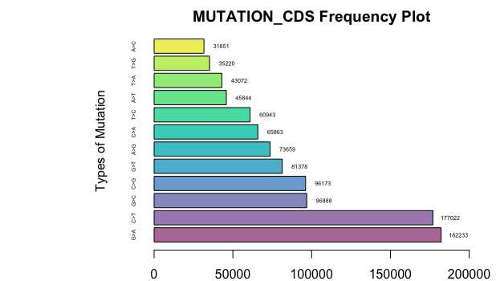

```{r setup, include=FALSE}
library(CANMutVisual)
```

## Introduction

CANMutVisual tool provide a path to expand on simplification of cancer genome research by visualizaing the data. The package take in data files and process it to simplify and extract necessary data to produce organized data frame. This package also provides functions to plot the extracted data to visualize the genomic mutational frequency in specific type of cancer.

To download 'CANMutVisual':

```{r eval=FALSE}
require("devtools")
devtools::install_github("Jiyun1201/CANMutVisual", build_vignettes = TRUE)
library("CANMutVisual")
```

To list all functions available in CANMutVisual:

```{r eval=FALSE}
ls("package:CANMutVisual")
```

To list sample dataset in CANMutVisual:

```{r eval=FALSE}
data(package = "CANMutVisual")
```

## Functions

Details on 6 functions available in this package: 

### 1. cosImport 
function reads .tsv file that contain specific cancer types' 
gene data (which will be inputed from users) and common approved HGNC id file. 
The function extracts only the necessary columns of data and return the resulting data frame. 

``` {r eval=FALSE}
CANMutVisual::cosImport("Data/MutantData.tsv", "Data/HGNC.tsv")
```


**2. countMut** function uses cosImport function in cosImport.R file to read from
cosmic file and uses that dataframe to extract IDsymbol column and return the
occurrence frequency of each gene types.

``` {r eval=FALSE}
CANMutVisual::countMut("Data/MutantData.tsv", "Data/HGNC.tsv")
```


**3. mut_cds** function uses cosImport function in cosImport.R file to read from
cosmic file and uses that dataframe to obtain MUTATION_CDS column
The last three letters are extracted and compared with mutValue list and unmatched 
elements are deleted. Then, dataframe with two columns returned.

``` {r eval=FALSE}
CANMutVisual::mut_cds("Data/MutantData.tsv", "Data/HGNC.tsv")
```


**4. plot_top_15** function uses countMut function in countMut.R file 
to get frequency data of each gene and return piechart using the data extracted.

``` {r eval=FALSE}
CANMutVisual::plot_top_15("Data/MutantData.tsv", "Data/HGNC.tsv")
```


**5. plot_cds** function uses mut_cds function in mut_cds.R file to get 
frequency data of each mutation and return barplot using the data extracted

``` {r eval=FALSE}
CANMutVisual::plot_cds("Data/MutantData.tsv", "Data/HGNC.tsv")
```



**5. runCANMutVisual** function runs shiny app to allow users with limited understanding of R language to be able to use the package to visualize and analyze data. 

``` {r eval=FALSE}
CANMutVisual::runCANMutVisual()
```

<br>

## References

Cosmic. (2021, May 28). Data downloads (release V94, 28th May 2021). Download
Files. Retrieved November 21, 2021, from https://cancer.sanger.ac.uk/cosmic/download.

Custom downloads HGNC. HGNC. (n.d.). Retrieved
November 21, 2021, from https://www.genenames.org/download/custom/.

Wickham, H., Hester, J., &amp; Francois, R. (2021, November 11). Read
rectangular text data [R package readr version 2.1.0]. The Comprehensive
R Archive Network. Retrieved November 21, 2021,
from https://cran.r-project.org/web/packages/readr/index.html.

Wickham, H. (n.d.). stringr: Simple, Consistent Wrappers for Common String
Operations. Introduction to stringr. Retrieved November 21, 2021,
from https://cran.r-project.org/web/packages/stringr/vignettes/stringr.html.

Lemon, J., Bolker, B., Oom, S., &amp; Klein, E. (n.d.). Package plotrix. CRAN.
Retrieved November 22, 2021, from https://cran.r-project.org/web/packages/
plotrix/index.html.


Kabacoff , R. (n.d.). Bar plots. Quick-R: Bar Plots. Retrieved November 21,
2021, from https://www.statmethods.net/graphs/bar.html.

Abedin, J., &amp; Mittal, H. V. (n.d.). R Graphs. R Graphs Cookbook (Second
Edition) - Displaying values on top of or next to the bars. Retrieved November
21, 2021, from https://subscription.packtpub.com/book/big_data_and_business_
intelligence/9781783988785/6/ch06lvl1sec69/displaying-values-on-top-of-or-
next-to-the-bars.


----

```{r}
sessionInfo()
```
